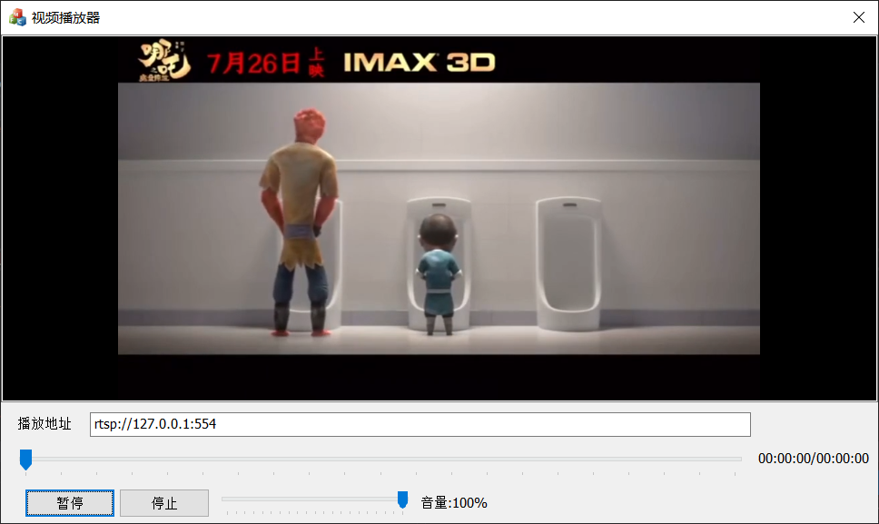

# RTSP视频服务器
## 项目概述
使用C++实现的一个RTSP服务器和一个封装vlc后的客户端
## 开发环境
vs2019 + Ubuntu 18.04 LTS
## 主要功能
1. 服务端支持 H264 视频格式的转发。
2. 客户端支持本地视频文件和网络串流的播放。

## 后续优化
1. 添加对音频的支持
2. 添加多种视频格式的支持

## 项目演示

## 文件目录
VideoPlayer：本地播放器  
VideoServer：视频服务器  